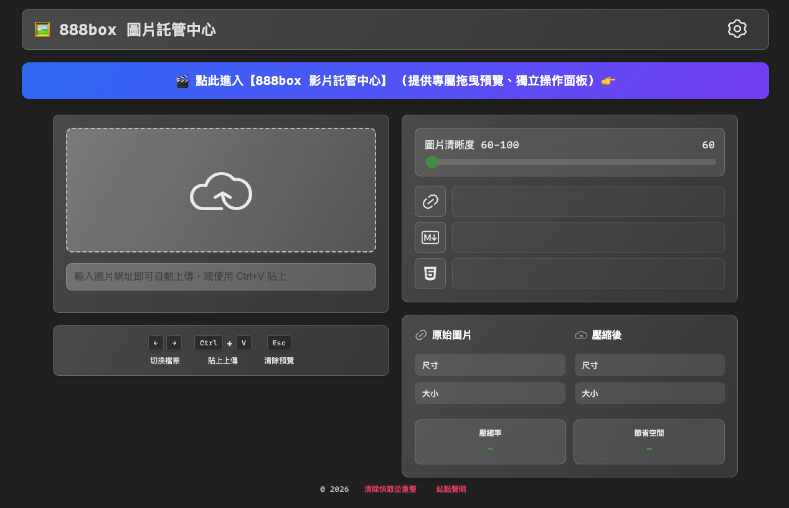
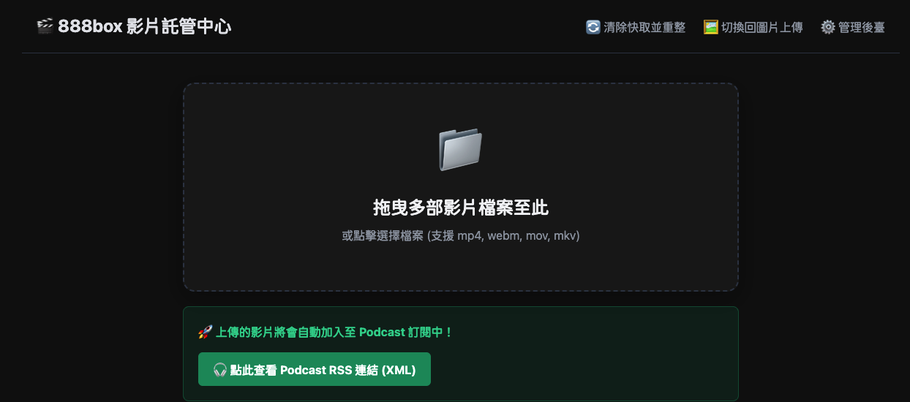
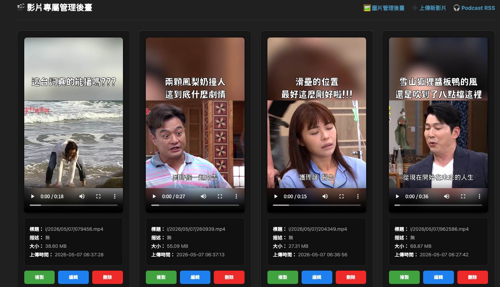

# 888box

一款專為個人或企業需求設計的高效媒體託管解決方案，完美分離了「圖片」與「影片」的處理邏輯與介面。支援 AWS S3 等多種儲存後端，並具備自動提取影片 MetaData、封面圖生成及 Podcast RSS 自動同步更新功能。

## ✨ 核心功能亮點






### 🖼️ 圖片託管系統
- **多儲存後端**：支援本地、AWS S3、OSS、又拍雲。
- **智慧處理**：具備自動壓縮與格式轉換（如轉為 WebP），有效節省空間。
- **專屬介面**：提供獨立的瀑布流圖片管理後台。

### 🎬 影片與 Podcast 系統 (全新升級)
- **專屬上傳介面**：不再與圖片混用，提供獨立的 `/upload_video.php` 大螢幕拖曳上傳區。
- **格式支援**：接受 `mp4`, `webm`, `mov`, `mkv` 等主流影片格式。
- **影片管理後台**：提供獨立的 `/admin/video.php`，專為影片設計的條列式管理與預覽。
- **Metadata 編輯**：支援在上傳時或於影片後台中，自由編輯「影片標題」與「影片描述」。
- **智慧檔名提取**：上傳影片時，若未填寫標題，系統將自動提取您的原始檔案名稱（支援中文）作為影片標題，徹底告別難以辨識的隨機亂碼檔名。
- **自動化 Podcast RSS**：上傳影片後自動生成符合 iTunes 規範的 `podcast.xml` 饋送；在後台修改 Metadata 或刪除影片時，RSS 將**即時自動同步重組**。
- **自動封面圖與 MetaData**：透過內建的 FFmpeg 自動從影片截取首幀作為封面圖，並提取時長與解析度。

## 🚀 部署教學 (Deployment)

強烈建議使用 Docker 進行部署，以確保環境一致性（特別是需要底層編譯 FFmpeg 以支援影片解析）。

### 1. 系統需求
- Docker & Docker Compose
- Nginx 或其他反向代理伺服器（可選，建議配置 HTTPS）

### 2. 安裝步驟

```bash
git clone https://github.com/tbdavid2019/888box.git
cd 888box

# 2. 構建並啟動容器 (首次啟動會自動編譯 FFmpeg 與 PHP 擴展，並解除 PHP 檔案大小限制至 500MB)
docker compose up --build -d

# 3. 初始化權限 (重要)
# 由於容器內以 www-data 執行，需確保宿主機上的 storage 目錄可寫
mkdir -p storage/i
chmod -R 777 storage

# 4. 如果未來需要重置環境或清理舊代碼快取，請執行：
# docker compose down
# docker volume rm 888box_888box-data
# docker compose up --build -d
```

### 3. 初始化設定
啟動後，請打開瀏覽器訪問安裝頁面進行資料庫與管理員設定：
- **安裝 URL**: `http://<你的網域或IP>:6767/install`

---

## 📖 使用教學與路由 (Usage & URLs)

安裝完成後，系統將分為兩大獨立區塊：

### 網頁介面 (人類使用者)
- **🖼️ 圖片專屬上傳 UI**: `https://<你的網域>/`
- **🎬 影片專屬上傳 UI**: `https://<你的網域>/upload_video.php` (可編輯 Podcast 標題與描述)
- **⚙️ 圖片管理後台**: `https://<你的網域>/admin/` (支援設定系統參數，如：自訂最大影片上傳大小)
- **⚙️ 影片管理後台**: `https://<你的網域>/admin/video.php` (支援影片播放、刪除、編輯 Metadata，並自動同步 RSS)

### API 介面 (自動化與機器人)
若需使用程式或機器人上傳，請在 HTTP Header 帶上 `Authorization: Bearer <Your_Token>`（Token 可於圖片後台設定）。

- **影片專用上傳 Endpoint**: `https://<你的網域>/video.php`
  - Method: `POST`
  - Body (form-data): `file=@your_video.mp4` (可選填欄位: `title`, `description`)
  - 成功回傳: JSON，包含影片 URL、封面圖 URL、時長等 MetaData。
- **圖片專用上傳 Endpoint**: `https://<你的網域>/api.php`
  - Method: `POST`
  - Body (form-data): `image=@your_image.jpg`

### 🎧 公開資源與 RSS 訂閱
系統會自動彙整你上傳的影片，產生下列公開資源供外部讀取：

- **Podcast RSS 訂閱**: `https://<你的網域>/storage/podcast.xml`
  - 可直接將此網址貼入 Apple Podcasts, Spotify 或其他 Podcast 播放器中訂閱。任何刪除或標題修改都會即時反應在此檔案中。
- **每日影片 JSON**: `https://<你的網域>/storage/YYYY-MM-DD/videos.json`
  - 提供給自動化系統（如 Telegram Bot, Webhook）抓取當日更新的影片清單。

## 致謝

感謝[原作者JLinMr](https://github.com/JLinMr/PixPro) 的啟發。
