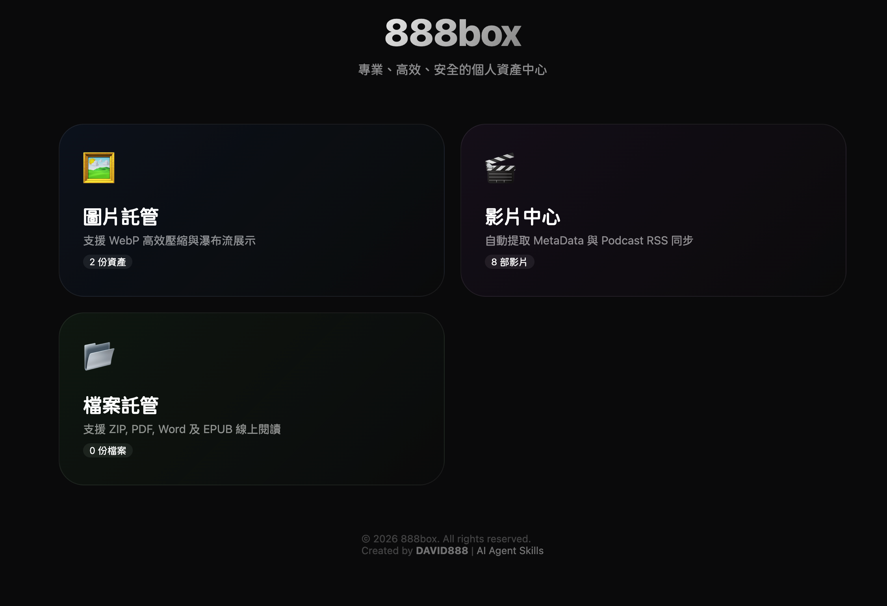
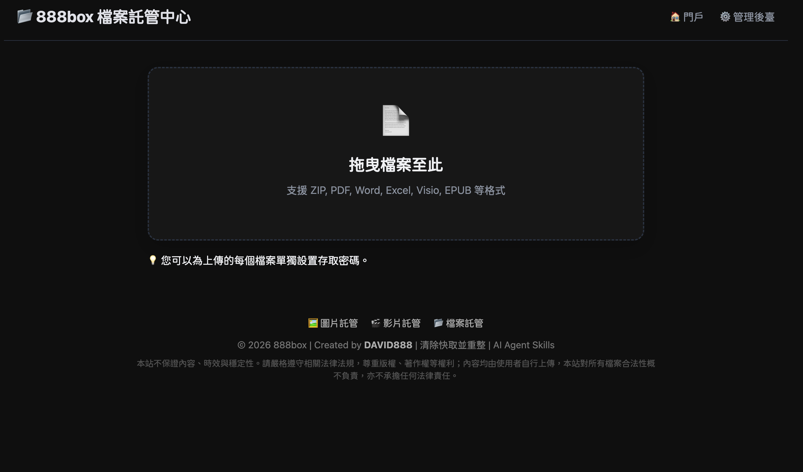

# 888box



一款專業級、全方位的媒體與文件託管解決方案。採用全新的 **Bento Grid** 門戶設計，將「圖片」、「影片」、「音訊」與「文件」完美整合，並具備強大的安全性、分析與舉報系統。支援 AWS S3 等多種儲存後端，具備自動提取 MetaData、Podcast RSS 同步、EPUB 線上閱讀及點擊次數追蹤等功能。

### 🚀 跨類型全能智慧上傳區 (Smart Universal Dropzone)
- **首頁一站式託管**：首頁直接提供全能拖曳與剪貼簿 (`Ctrl+V`) 智慧上傳區，免點擊切換頁面。
- **自動類型辨識**：前端自動分析 MIME Type 與副檔名，智慧分類為圖片 🖼️、影片 🎬、音訊 🎙️ 或文件 📂。
- **即時進度與一鍵分享**：提供百分比動態進度條、1 秒複製短連結與即時預覽按鈕，並實時連動首頁統計卡片。

### 🎨 Lucide 向量圖示與精緻 UI
- **Lucide Icon 離線整合**：全站移除舊式 Alibaba Iconfont 腳本，改採 100% 離線 Lucide 向量圖示庫 (`static/js/lucide.min.js`)。
- **美化短網址 (Pretty Short URLs)**：採用 `/v/{short_token}` 清爽短網址格式，且 100% 向下相容舊版 32 位元長 Token 連結。
- **無標題自動隱藏**：未填寫標題之資產自動隱藏大標題，節省視覺版面。
- **浮動黏性導覽 (Sticky Header)**：分享頁頂部麵包屑配備毛玻璃懸浮效果，捲動時始終固定於視窗頂部。
- **嵌入與外鏈代碼面板**：預覽頁面提供直連網址、Markdown、HTML 與 BBCode 一鍵複製。
- **圖片尺寸元數據**：自動檢測並標示圖片寬高解析度 (`Width × Height px`)。
- **Webtalk Chat 聊天小工具**：公開頁面全面內嵌 Webtalk 即時對談小工具。

### 🖼️ 圖片託管中心
- **極速上傳**：支援拖曳、剪貼簿貼上上傳，具備強大的圖片壓縮與格式轉換（WebP）功能。
- **智能處理**：自動校正 JPEG 方向，保留/移除 Exif 資訊。
- **本機進度統計**：顯示本批成功上傳數，並在目前瀏覽器記錄圖片的今日與累計上傳數量。

### 🎬 影片與 Podcast 系統
- **自動化 RSS**：上傳影片後自動生成相容 iTunes 的 Podcast RSS (`podcast.xml`)，支援主流播客 App 訂閱。
- **MetaData 提取**：自動擷取影片長度、解析度、碼率，並於第 1 秒處自動生成預覽縮圖。
- **批次進度可視化**：影片佇列頁面會顯示本批成功數，以及這台裝置在目前瀏覽器中的今日/累計影片上傳數。

### 🎙️ 音訊與播客大廳
- **專業級音訊託管**：支援 `mp3`, `wav`, `aac`, `ogg`, `m4a`, `flac` 等格式，自動生成獨立 Podcast 音訊 Feed (`podcast_audio.xml`)。
- **精品細節播放器**：整合 HTML5 播放器，配備精心設計、隨播放事件動態旋轉的仿實體 CD 唱盤視覺特效。
- **管理後台與批次佇列**：專屬的音訊上傳與批次佇列管理，自動提取時長與位元率資訊。

### 📂 文件託管中心
- **萬用支援**：支援 ZIP, PDF, Word, Excel, Visio 等多種文件格式。
- **EPUB 閱讀器**：內建 `epub.js` 支援，電子書可直接線上閱讀，無需下載。
- **本機上傳計數**：文件上傳頁面會在不依賴後端資料庫的情況下，顯示本批成功數與裝置端的今日/累計上傳數。


### 🛡️ 安全、分析與舉報
- **通用 Gatekeeper**：所有資源均可設定存取密碼，透過毛玻璃 UI 進行驗證。
- **點擊分析**：追蹤每一項資源的「真實點擊次數」。
- **舉報系統**：內建舉報功能，方便管理違規內容。

### 🤖 AI 代理人整合 (AI Agent Integration)
- **動態技能指南 (`skill.php`)**：為 AI 代理人（如 Claude, GPT）提供動態生成的指令文檔，自動識別 Base URL 並在登入狀態下注入 Token。
- **MCP 支援 & 伺服器卡片**：提供符合 Model Context Protocol (MCP) 標準的 `mcp.php` 端點，並在 `/.well-known/mcp/server-card.json` 發布 MCP Server Card。
- **RFC 9727 API 目錄**：於 `/.well-known/api-catalog` 提供符合 RFC 9727 `application/linkset+json` 標準的 API 發現配置，方便自動解析。
- **Agent Skills 發現索引**：於 `/.well-known/agent-skills/index.json` 發布代理人專屬技能索引。
- **WebMCP 支援**：首頁內嵌 WebMCP 控制，向 AI 瀏覽器主動暴露 `upload_image`、`list_assets`、`search_assets` 與 `get_stats` 工具。
- **RFC 8288 發現連結**：首頁 Response Header 具備 RFC 8288 `Link` 屬性，引導 Agent 自動探測 sitemap、api-catalog 與技能頁。
- **爬蟲控管與 Content Signals**：支援 RFC 9309 規範，於 `robots.txt` 宣告 `Content-Signal: search=yes, ai-train=no` 訊號，拒絕 AI 爬蟲進行模型訓練，並預設封鎖 GPTBot、ClaudeBot 等 AI 採集器。

---

## 🚀 快速開始

### 推薦安裝方式 (一鍵腳本)
只要你的伺服器具備 Docker 與 Git，執行以下指令即可完成安裝：

```bash
git clone https://github.com/tbdavid2019/888box.git
cd 888box
./install.sh
```

**該腳本會自動完成：**
1.  **環境檢查**：確保 Docker 正常運作。
2.  **目錄初始化**：建立 `storage/` 並設定正確的權限。
3.  **配置生成**：產生預設的 `.env` 環境變數檔。
4.  **容器啟動**：自動編譯與啟動 Docker 容器。
5.  **共用 Bootstrap**：透過 `config/schema.php` 建立核心 schema 與基礎設定，不再由不同安裝入口各自維護一套 SQL。
6.  **互動式設定**：引導你設定第一個**管理員帳號與密碼**。

### 安裝與升級注意事項
- Docker 容器內實際寫入 `storage/` 的使用者是 `www-data`（UID/GID 33），包含 `storage/database.db`、`storage/podcast.internal.xml`、`storage/podcast.internal.xml.lock`、`storage/podcast_audio.internal.xml`、`storage/podcast_audio.internal.xml.lock`。
- 若你在宿主機用 `root` 手動重建 RSS、複製檔案、或直接覆寫 `storage/` 內容，可能會把檔案 owner 改成 `root:root`，進而導致後續影片上傳成功但 RSS 無法更新。
- `install.sh` 會先在宿主機嘗試 `chown -R 33:33 storage`，容器啟動後也會再執行一次 `docker exec 888box chown -R 33:33 /var/www/html/storage`，目的是把 writable 檔案統一交回 `www-data`。
- 若既有站台出現 RSS 停止更新，可優先檢查：
  ```bash
  docker exec 888box sh -lc 'stat -c "%U:%G %a %n" /var/www/html/storage/database.db /var/www/html/storage/podcast.internal.xml /var/www/html/storage/podcast.internal.xml.lock /var/www/html/storage/podcast_audio.internal.xml /var/www/html/storage/podcast_audio.internal.xml.lock'
  ```
- 若 owner 不是 `www-data:www-data`，可修正為：
  ```bash
  docker exec 888box chown -R 33:33 /var/www/html/storage
  ```
- 專案目前預設 `max_uploads_per_day` 為 `100`。`install.sh` 會在新安裝時寫入這個值，但既有部署若資料庫裡已經有舊值（例如 `50`），升級程式碼後不會自動覆蓋，需另外更新 `configs` 表或從後台設定頁修改。
- 舊版 SQLite 若缺少 `images.is_video`、`images.is_file`，現在會在 runtime / install / migration 流程中由 `config/schema.php` 自動補欄位並回填既有資料，不需要手動執行 `ALTER TABLE`。

### `.env` 範例
專案現在提供 [.env.example](.env.example)。若你不走互動式安裝，可先複製一份：

```bash
cp .env.example .env
```

### S3 快速說明
- `install.sh` 目前使用的 S3 參數名稱為 `S3_ACCESS_KEY_ID` / `S3_ACCESS_KEY_SECRET` / `S3_BUCKET` / `S3_REGION` / `S3_ENDPOINT` / `S3_CDN_DOMAIN` / `S3_ACL`
- 若使用 AWS S3 並希望上傳後可直接公開讀取，通常需要：
  - `S3_ACL=public-read`
  - bucket 具備公開讀取 policy (`s3:GetObject` on `arn:aws:s3:::your-bucket/*`)
- 若使用 Cloudflare R2 等不建議 ACL 的 Provider，`S3_ACL` 可留空，但你仍需自行處理對外讀取策略

### 建立 S3 Bucket
若你要快速建立一個新的 AWS S3 bucket 與對應金鑰，可使用：

```bash
./setup_s3.sh
```

該腳本目前會：
- 建立 bucket
- 建立 IAM user 與 access key
- 關閉 bucket 的 public access block 限制
- 設定 `BucketOwnerPreferred`
- 寫入公開讀取 bucket policy
- 產生 `.env.s3`，內含 `S3_ACCESS_KEY_ID`、`S3_ACCESS_KEY_SECRET`、`S3_CDN_DOMAIN`、`S3_ACL=public-read`

---

## 🛠️ 開發與架構

- **Backend**: PHP 8.1+ (Apache)
- **Frontend**: Vanilla JS (ES Modules)
- **Storage**: SQLite 3 (持久化於 `storage/database.db`)
- **Dependencies**: FFmpeg, ImageMagick, Composer
- **Docker**: 支援 x86_64 與 ARM64 (Apple Silicon / AWS Graviton)

### Schema Source Of Truth
- 核心資料表定義與 bootstrap 邏輯統一放在 [config/schema.php](config/schema.php)
- `config/database.php`、`install/index.php`、`install.sh`、`migrate.php` 都共用這一份定義
- 若未來需要新增核心欄位或調整初始化行為，應優先修改 `config/schema.php`
- `images` 表除了圖片，也承載影片與一般檔案；目前透過 `mime_type`、`is_video`、`is_file` 區分資產類型
- 既有資料庫若缺少這些旗標欄位，`ensureCoreSchema()` 會自動補齊並回填舊資料，避免不同部署之間 schema 漂移

### 手動管理指令
- **啟動**：`docker compose up -d`
- **停止**：`docker compose stop`
- **更新代碼**：`git pull && docker compose restart`
- **重構環境**：`docker compose up -d --build` (當 Dockerfile 有變動時)
- **同步環境變數後重啟**：若修改 `.env` 的儲存設定，建議執行 `docker compose restart`
- **部署 schema / Dockerfile 變更**：若更新包含 migration、自動補欄位或容器權限調整，建議使用 `git pull && docker compose up -d --build`
- **手動建立/重設管理員帳號**：
  若未執行安裝腳本，可透過此指令建立帳號（請替換 `YOUR_USER` 與 `YOUR_PASS`）：
  ```bash
  docker exec -it 888box php -r "$u='YOUR_USER'; $p='YOUR_PASS'; $pdo = new PDO('sqlite:/var/www/html/storage/database.db'); $h = password_hash($p, PASSWORD_DEFAULT); $t = bin2hex(random_bytes(16)); $stmt = $pdo->prepare('INSERT OR REPLACE INTO users (username, password, token) VALUES (?, ?, ?)'); $stmt->execute([$u, $h, $t]); echo \"User $u created.\n\";"
  ```
- **檢查每日上傳限制**：
   ```bash
   docker exec -it 888box php -r '$pdo = new PDO("sqlite:/var/www/html/storage/database.db"); echo $pdo->query("SELECT value FROM configs WHERE key = '\''max_uploads_per_day'\'' LIMIT 1")->fetchColumn(), PHP_EOL;'
   ```

### 前端本機統計說明
- `upload_image.php`、`upload_video.php`、`upload_file.php` 都會顯示「本批成功」、「今日上傳」、「累計上傳」。
- 「本批成功」只統計目前這一批 queue 中成功完成的項目，清空列表或重新建立新 queue 後會重新計算。
- 「今日上傳」與「累計上傳」儲存在瀏覽器 `localStorage`，只對目前裝置與目前瀏覽器有效，不會跨裝置同步。
- 若使用者清除瀏覽器資料、改用其他瀏覽器、或從其他 API / 後台入口上傳，這些本機統計不會保留或合併。

## 📄 授權協議
本專案採用 AGPL-3.0 授權協議。詳見 [LICENSE](LICENSE) 檔案。
